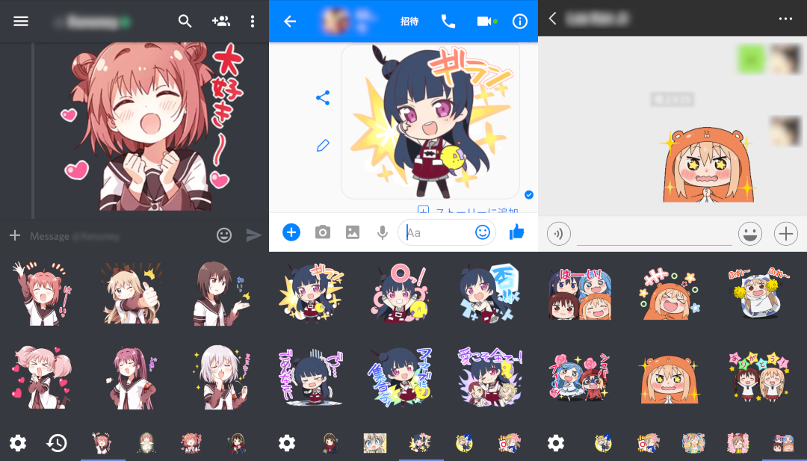

Any inquiries or problems, feel free to open an Issue.

# LINEStickerKeyboard
Image Keyboard for Android which aim to port LINE stickers to other SNS, static or animated! 

_(predecessor: [Android Discord Line Stickers](https://github.com/jeffshee/ad-linestickers))_

## Disclaimer
**Use at your own risk.** This app is not affiliated with, maintained, authorized, endorsed or sponsored by the LINE Corporation or any of their affiliates. We take no resposibility or liability for using this app.

## Please Read
Some serious stuff here... This app is making use of **preview images** from the official web page itself. All right go to their respective owners. As described above, this app aims to **port** your favorite stickers to other SNS you are using, not to **steal**! Please **don't** use this app on LINE itself, and **do** buy those stickers to show support to their authors! We hope you all play fair. 

## Download
**This app wouldn't be available on Play Store**, sorry about that. Please refer to [release](https://github.com/jeffshee/LINEStickerKeyboard/releases) section for the APK file. Or you can clone the source and build it yourself as well ;)

## How to use
Since almost everything are pretty straight forward, here we only show **how to add sticker** to the keyboard. There are 2 ways:
1. Automatic (For those who already had LINE installed)

Launch LINE > Go to 'Sticker Shop' > Pick your sticker > Click at the 'share' button > Share it to 'Fetch Sticker'

2. Manual (For those who don't have LINE installed)

Using your web browser, go to LINE's Sticker Shop > Pick your sticker > Look at the URL, for example: `https://store.line.me/stickershop/product/5417218/en` In this case, `5417218` will be the Store ID, remember this. Launch the app > go to My Collections > Click at the 'Manual Add' > Enter the Store ID

## Credit
Icon made by Freepik from www.flaticon.com 
